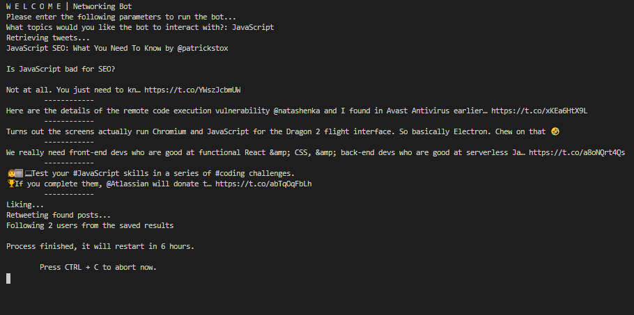

# Twitter Bot - Networking

> This is a Twitter bot built in Ruby using the Twitter API (through the Twitter gem). It likes, retweets and follows the poster of a number of retrieved tweets and will repeat this action after 6 hours.

The objective of this bot is to "automatically" generate interaction in your twitter account to make networking easy. If your interest is software development, setting up the bot to interact with the given topic will grow your network by finding posts and people related to this subject. When interacting with these people's posts and following them they are likely to do the same with you.

## Screenshot

## Potential features

- Having the bot run a maintenance check on the profile to unfollow any inactive users.
- Have a setup prompt to authenticate the user for the API.

## Prerequisites

- Ruby 2.4 or newer

## Setup Instructions

1. Clone/download the repo and open the terminal in the project folder.
2. Execute "gem install twitter".
3. Set up a twitter developer account and create an app there. ([How to](https://www.extly.com/docs/autotweetng_joocial/tutorials/how-to-auto-post-from-joomla-to-twitter/apply-for-a-twitter-developer-account/#apply-for-a-developer-account))
4. Go to the lib/config.rb file and enter your keys from your twitter app.
5. Run "ruby bin/main.rb" from the project folder.

## Expected program flow

- You are prompted to enter a topic for the bot to interact with at the beginning of the program execution.
- The bot will try to retrieve the 5 most popular tweets regarding the subject.
- If there are no popular tweets with that subject in the last 7 days, the 15 most recent are used instead (This is a Twitter limitation for standard API use).
- The bot will like and retweet only posts that are not spammy (include strings like: free, free course, click, click here).
- It will follow 2 randomly selected authors of the retrieved tweets.
- The program will re-do the same after 6 hours (to avoid spamming and getting repeated posts) unless you stop execution or re-run it with a different subject.

## Built With

- Ruby
- Twitter gem

## Authors

👤 **Sebastian Gil Rodriguez**

- Github: [@sebGilR](https://github.com/sebGilR)
- Twitter: [@sebGilR](https://twitter.com/sebGilR)
- Linkedin: [linkedin](https://www.linkedin.com/in/sebastiangilrodriguez)

## 🤝 Contributing

Contributions, issues and feature requests are welcome!

Feel free to check the [issues page](issues/).

## Show your support

Give a ⭐️ if you like this project!

## Acknowledgemante

- Thanks to [Erick Berlin](https://github.com/sferik) and the Twitter gem collaborators.
